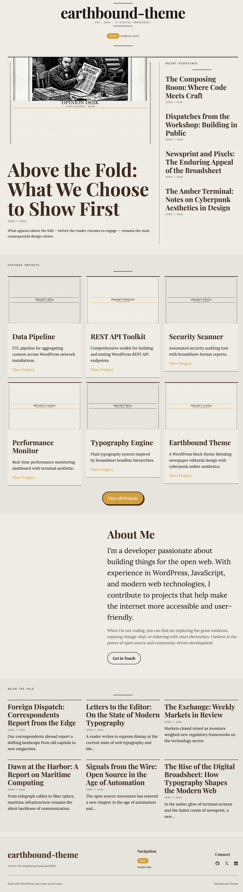
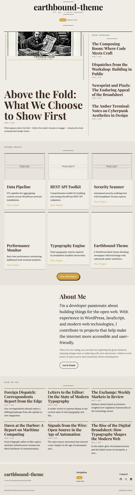
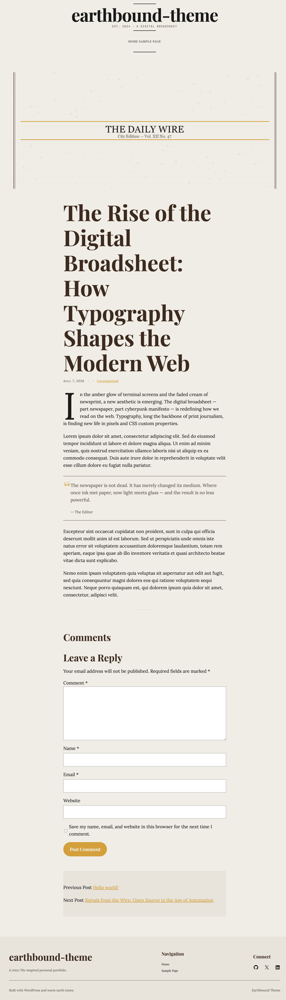

# Earthbound Theme

A WordPress block theme blending old-time newspaper editorial design with cyberpunk amber aesthetics. Built for WordPress 6.7+ using Full Site Editing, the Interactivity API, and modern PHP 8.1+ features.



## Features

- **Newspaper masthead header** with decorative rules, centered title, monospace dateline, and section navigation with vertical bar separators
- **Multi-column front page** with asymmetric 2/3 + 1/3 lead/sidebar layout, column rules, and below-the-fold grid
- **Editorial serif typography** — Playfair Display for headlines, Lora for body, JetBrains Mono for code and terminal accents
- **Fluid type scale** with dramatic range (hero up to 6rem) for broadsheet-style headline hierarchy
- **Amber cyberpunk accents** — amber glow on headline hover, terminal badges, amber underline links, dark panel sections
- **Typographic flourishes** — thin-thick-thin newspaper rules, small-caps section labels, drop caps, pull quotes with hairline borders
- **Newsprint-amber color palette** — aged cream background, near-black ink, warm amber accent, dark panel color for cyberpunk sections
- **Four style variations**: Harvest Gold, Desert Sunset, Forest Grove, Ocean Tide
- **Projects custom post type** for portfolio display
- **GitHub and WordPress Trac feed integration** via custom blocks
- **Full accessibility** — keyboard navigation, screen readers, reduced motion, focus indicators

## Screenshots

### Home Page

| Desktop | Mobile |
|---------|--------|
|  |  |

### Single Post

| Desktop | Mobile |
|---------|--------|
|  |  |

## Installation

1. Download or clone this repository into `wp-content/themes/`
2. Activate via **Appearance > Themes** in the WordPress admin
3. Set a static front page under **Settings > Reading** to use the newspaper layout

### Local Development

```bash
npx @wordpress/env start
```

> **Note:** On Docker Desktop for Mac, bind mounts may not sync to the Apache container. If the site renders blank, copy the theme into the container:
> ```bash
> docker cp . $(docker ps --format '{{.Names}}' | grep wordpress-1 | grep -v tests):/var/www/html/wp-content/themes/earthbound-theme/
> ```

## Style Variations

| Variation | Primary | Background |
|-----------|---------|------------|
| **Harvest Gold** (default) | Amber `#D4A03C` | Newsprint `#F0EDE6` |
| **Desert Sunset** | Terracotta `#E07B53` | Parchment `#F2EDE6` |
| **Forest Grove** | Olive `#6B8E23` | Birch `#EFEEE8` |
| **Ocean Tide** | Cadet Blue `#5F9EA0` | Sea Foam `#ECEEED` |

## Typography

| Role | Font | Usage |
|------|------|-------|
| **Headings** | Playfair Display | Headlines, site title, buttons |
| **Body** | Lora | Body copy, excerpts, paragraphs |
| **Monospace** | JetBrains Mono | Code blocks, datelines, terminal badges |

## Requirements

- WordPress 6.7+
- PHP 8.1+

## License

GPL-2.0-or-later
